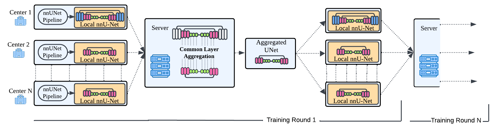
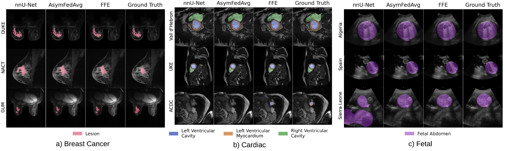
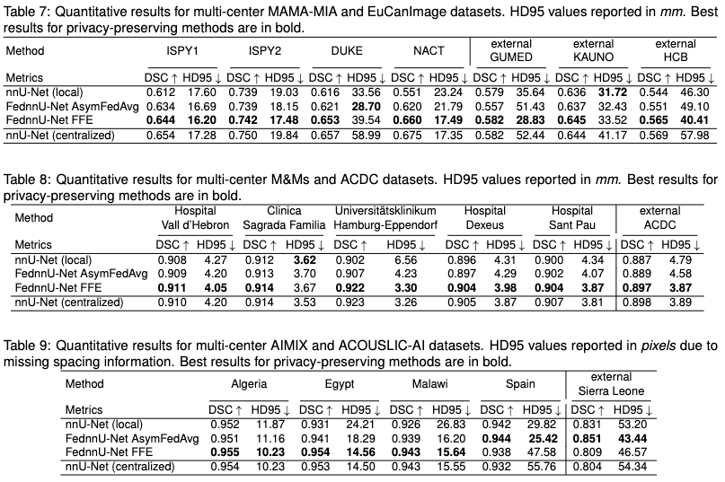
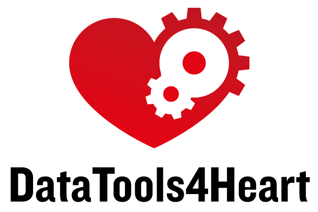
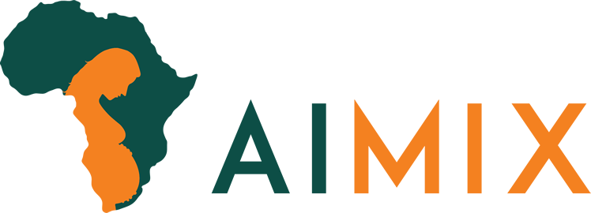

# FednnU-Net

[](https://www.python.org/)
[](LICENSE)
[](https://arxiv.org/abs/2503.02549)
[](https://github.com/psf/black)
[](https://github.com/MIC-DKFZ/nnUNet)
[](#)
[](#)
[](#)

> 🧩 *A federated extension of nnU-Net for privacy-preserving medical image segmentation.*

> Note: This is a work-in-progress repository that will be updated upon the acceptance of the submitted work.




**FednnU-Net** enables training [nnU-Net](https://github.com/MIC-DKFZ/nnUNet) models in a **decentralized**, **privacy-preserving** manner — while maintaining full compatibility with the original framework.

📄 **Preprint:** [*Skorupko, G., Avgoustidis, F., Martín-Isla, C., Garrucho, L., Kessler, D. A., Pujadas, E. R., ... & Lekadir, K. (2025). Federated nnU-Net for Privacy-Preserving Medical Image Segmentation. arXiv preprint arXiv:2503.02549.*](https://arxiv.org/abs/2503.02549)

---


**🩻 Modalities Evaluated:**

* 🩷 **Breast MRI**
* ❤️ **Cardiac MRI**
* 🤰 **Fetal Ultrasound**

**🚀 Key Findings:**

* ⚙️ **Adaptive aggregation** enables robust cross-site learning.
* 📈 Achieves **performance comparable to or surpassing centralized training**.
* 🧩 Demonstrates strong **scalability and real-world applicability** in federated medical imaging.

### 🧪 **Image Segmentation Performance**

**Federated nnU-Net** was tested on **real-world, multi-hospital datasets**, ensuring a realistic federated learning setup.



👉 See the **[Extended Results Table](#-extended-results)** for detailed tables.


## ⚙️ **Installation**

Clone and install FednnU-Net on all computational nodes that are part of the federated training (including the coordinating server)

```bash
git clone https://github.com/faildeny/FednnUNet
```

Then run the installation script that will clone the original nnUNet as a submodule and then will install both libraries

```bash
bash ./install.sh
```

✅ If you see:
`Installation complete. You can now use fednnUNet.`
then installation was successful.

## Training

### 🌍 Distributed Node Setup


Start server

```bash
python fednnunet/server.py command --num_clients number_of_nodes fold --port network_port
```

Start each node

```bash
python fednnunet/client.py command dataset_id configuration fold --port network_port
```

#### 💻 Start server and clients automatically (one machine setup)

For prototyping and simulation purposes, it is possible to start all nodes on the same machine. The dataset ids for each data-center can be provided as list in the following string form "dataset_id_1 dataset_id_2 dataset_id_3". 
```bash
python fednnunet/run.py train "dataset_id_1 dataset_id_2 dataset_id_3" configuration fold --port 8080
```

### 🗂️ Dataset Preparation
Prepare local dataset on each node in a [format](https://github.com/MIC-DKFZ/nnUNet/blob/master/documentation/dataset_format.md) required by nnU-Net.

### 🧪 Experiment Preparation
To run a complete configuration and training follow the steps of the original nnU-Net pipeline.
First, configure the experiment and preprocess the data by running ```plan_and_preprocess``` as the command for server and nodes.
After the experiment is prepared, you can start distributed training with ```train``` command.


Supported tasks
 - ```extract_fingerprint``` creates one common fingerprint based on data from all nodes
 - ```plan_and_preprocess``` extracts fingerprint + creates experiment plan and preprocesses data
 - ```train``` federated training of nnUNet

#### Original nnUNet's CLI arguments
`fednnunet/client.py` supports identical set of CLI arguments that can be passed during a typical `nnUNetv2_train` command execution


##### Example training command

To run training with 5 nodes on one machine for 3d_fullres configuration and all 5 folds:
```bash
python fednnunet/run.py train "301 302 303 304 305" 3d_fullres all --port 8080
```
### 🔀 Training Modes
Following the FednnU-Net paper, it is possible to train the model in two ways: Federated Fingerprint Extraction (FFE) and Asymetric Federated Averaging (AsymFedAvg). While both methods works well in different scenarios, it is best to use the FFE method as the starting point as it's more robust and gives results very close to models trained in a centralized way.

##### FFE
Run the federated 3d experiment configuration with:
```bash
python fednnunet/run.py plan_and_preprocess "301 302 303 304 305" 3d_fullres --port 8080
```
This command will:
 - extract the dataset fingerprint for each node
 - aggregate and distribute it's federated version to all clients
 - create a training plan on each node
 - preprocess all datasets locally for the requested configuration

Run the FFE training with:
```bash
python fednnunet/run.py train "301 302 303 304 305" 3d_fullres all --port 8080
```

This will run the FFE federated training for `3d_fullres` configuration model and `all` cross-validation folds.

##### AsymFedAvg

Run the 2d experiment configuration with:
```bash
python fednnunet/run.py plan_and_preprocess "301 302 303 304 305" 2d --asym --port 8080
```
This command will:
 - extract the dataset fingerprint for each node
 - create a training plan on each node
 - preprocess all datasets locally for the requested configuration

Run the FFE training with:
```bash
python fednnunet/run.py train "301 302 303 304 305" 2d 1 --port 8080
```

This will run the AsymFedAvg federated training for `2d` configuration model and `1` cross-validation fold.


## Evaluation

Each federated training node saves it's checkpoints and final model following the default nnU-Net behaviour. To evaluate the trained model on the local data, use the native commands provided in nnU-Net's [documentation](https://github.com/MIC-DKFZ/nnUNet/blob/master/documentation/how_to_use_nnunet.md):
```bash
nnUNetv2_predict -i INPUT_FOLDER -o OUTPUT_FOLDER -d DATASET_NAME_OR_ID -c CONFIGURATION --save_probabilities
```

## 📊 Extended Results




## 🧾 **Citation**
Please cite the following paper when using FednnU-Net:
> [*Skorupko, G., Avgoustidis, F., Martín-Isla, C., Garrucho, L., Kessler, D. A., Pujadas, E. R., ... & Lekadir, K. (2025). Federated nnU-Net for Privacy-Preserving Medical Image Segmentation. arXiv preprint arXiv:2503.02549.*](https://arxiv.org/abs/2503.02549)

```bibtex
@misc{fednnunet2025,
      title={Federated nnU-Net for Privacy-Preserving Medical Image Segmentation}, 
      author={Grzegorz Skorupko and Fotios Avgoustidis and Carlos Martín-Isla and Lidia Garrucho and Dimitri A. Kessler and Esmeralda Ruiz Pujadas and Oliver Díaz and Maciej Bobowicz and Katarzyna Gwoździewicz and Xavier Bargalló and Paulius Jaruševičius and Kaisar Kushibar and Karim Lekadir},
      year={2025},
      eprint={2503.02549},
      archivePrefix={arXiv},
      primaryClass={cs.CV},
      url={https://arxiv.org/abs/2503.02549}, 
}
```

## Funding
FednnU-Net is developed by the [Barcelona Artificial Intelligence in Medicine Lab (BCN-AIM)](https://www.bcn-aim.org/) at [Universitat de Barcelona](https://web.ub.edu/)


   

This work received funding from the European Union’s Horizon Europe research and innovation programme under Grant Agreement No. 101057849 (DataTools4Heart). This work has been supported by the European Union’s research and innovation programmes: Horizon Europe under Grant Agreement No. 101057699 (RadioVal) and Grant Agreement No. 101044779 (AIMIX), Horizon 2020 under Grant Agreement No. 952103 (EuCanImage).


       


